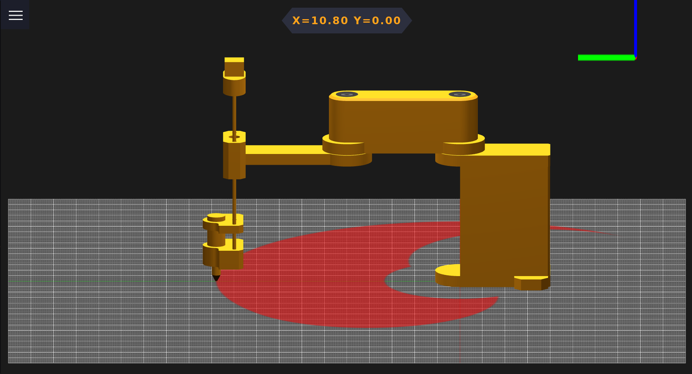
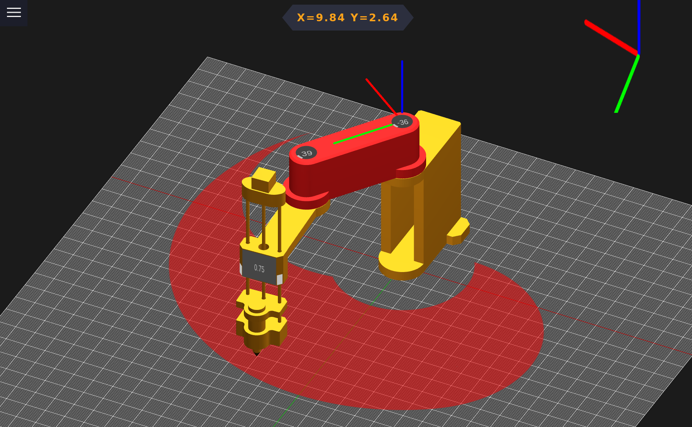

# Scara Arm

## Description
Ktor server to control Scara arm

- I built this project to experiment with robotic arms to be able to create more advanced robotic arms in the future.
- There are many possible applications for this, especially those related to G-Code.
- To create this project, I had to learn about the Ktor server, Three.js, and some mathematics in kinematics.

## Features
- moving the robotic arm manually (only on a computer).
- moving robotic arm by G-Code file.
- visualization of the G-Code file, arm movement.
- accounts and private files.

## Usage

## Installation

- Insert your keys in: src/main/kotlin/com/voidsamuraj/Keys.kt.
- The Project uses Kotlin and requires JVM.
- There is an included Three.js library; if you want to change the version, you have to change the import paths in the used lib files, as I did, e.g., "/static/three/build/three.module.js." Lib is under: src/main/resources/files/three.
- Build jar and Run.

## License
  This project is under GNU <a href="https://github.com/VoidSamuraj/ScaraArm/blob/master/LICENSE.txt">License</a>.

